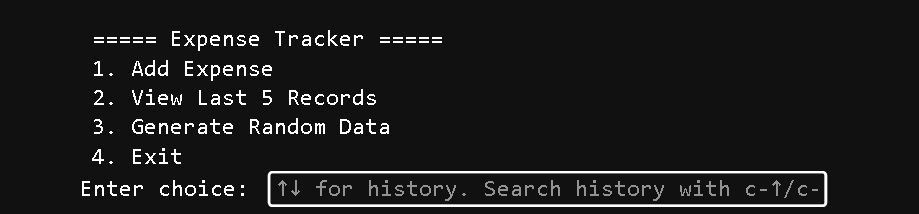
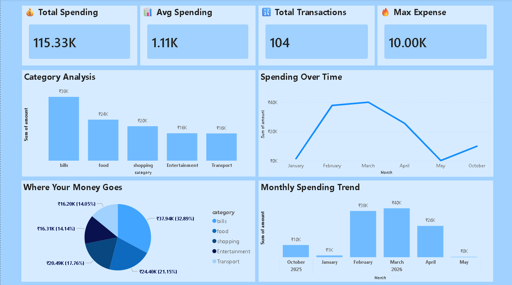

# 💰 Personal Expense Tracker & Spending Analysis

## 📌 Overview

This project is a **Python-based Personal Expense Tracker** that allows users to log daily expenses, store them in a SQLite database, analyze spending patterns, and visualize insights.

It also integrates with **Power BI** for interactive dashboard reporting.

---

## 🚀 Features

* 🧾 CLI-based expense entry system
* 🗄️ SQLite database integration
* 📊 Data analysis using Pandas
* 📈 Visualizations using Matplotlib & Seaborn
* 🎲 Random data generation for large-scale analysis
* 📉 Spending trend and category insights
* 📊 Power BI dashboard integration

---

## 🧰 Tech Stack

* Python
* Pandas
* Matplotlib
* Seaborn
* SQLite
* Power BI

---

## 📂 Project Structure

```
Personal_Expense_Tracker/
│── expenses.db
│── expenses_powerbi.csv
│── expense_tracker.ipynb
│── README.md
```

---

## ▶️ Usage

### Run the CLI system:

* Add expenses manually
* Generate random data
* View recent transactions

### Perform Analysis:

* Category-wise spending
* Monthly trends
* Expense distribution

### Power BI:

* Import `expenses_powerbi.csv` into Power BI
* Build dashboard using KPIs and charts

---

## 📊 Dashboard Insights

* 💰 Total Spending
* 📊 Average Spending
* 🔝 Top Categories
* 📅 Monthly Trends
* 📉 Spending Patterns

---

## 📸 Screenshots

# 🧾 CLI Interface


# 📊 Data Visualization


# 📈 Power BI Dashboard


---

## 🧠 Key Learnings

* Data cleaning and transformation using Pandas
* Database handling with SQLite
* Data visualization best practices
* Building interactive dashboards in Power BI

---

## 📌 Future Improvements

* Add machine learning model for spending prediction
* Web app using Streamlit
* Budget alerts and notifications
* Multi-user support

---

## 👤 Author

**Saurabh**
Aspiring Data Analyst

---

## ⭐ If you like this project

Give it a star ⭐ and share your feedback!
